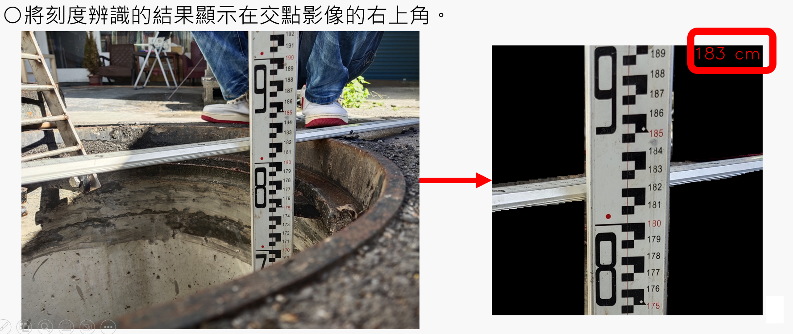

# 智慧箱尺量測系統 Smart Staff Gauge Measurement System

## 專案簡介

本系統為與**坤眾科技股份有限公司**產學合作開發之專案。
針對道路施工現場箱尺深度量測作業，提供自動化的影像辨識與紀錄解決方案，
取代傳統人工測量與手動紀錄，降低施工風險並提升工程品質。

---

## 動機與目的

- **解決測量誤差問題**：現行道路挖掘深度多依賴人工測量與手動紀錄，
  容易因操作錯誤造成數值不準確，導致施工風險增加及工程品質下降。
- **減少紀錄錯誤**：施工現場環境凌亂忙碌，容易造成記錄資料品質低落或不齊全。
- **提高量測準確性與作業效率**：透過即時深度量測，減少因人工紀錄帶來的風險。
- **自動化紀錄**：提供自動化的記錄方式，提高資料的效率、準確性與品質。


---

## 系統架構
```
施工現場 → 前端 App（影像上傳）→ 後端伺服器（AI 辨識）→ 資料庫儲存
```

### 前端
- 手機 App 介面：拍攝箱尺影像並上傳
- 自動附帶 GPS 經緯度座標與時間戳記

### 後端（伺服器端）
- **YOLO v8 箱尺實例分割模型**：偵測箱尺物件
- **YOLO v8 箱尺數字物件偵測模型**：辨識刻度數字
- **刻度量測演算法**：計算實際深度數值
- **基於多特徵融合的模糊識別演算法**：提升辨識準確率
- 結果回傳至前端並儲存至資料庫

---

## 技術亮點

- 影像輸入自動辨識箱尺刻度，輸出量測結果（例：183cm）
- 結合 GPS 與時間資訊，完整記錄每筆量測資料
- 全程自動化，無需人工判讀

---

## 合作單位

- **坤眾科技股份有限公司**（受政府單位委託，提供箱尺影像資料）
